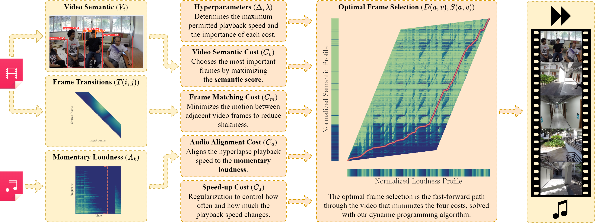

# A Multimodal Frame Sampling Algorithm for Semantic Hyperlapses with Musical Alignment

| [Paper](http://urlib.net/ibi/8JMKD3MGPEW34M/4BU46CP) | [Project page](https://mavilab-ufv.github.io/projects) | [Video](https://www.youtube.com/watch?v=-60zNZ1Yz70) |
| ---------------------------------------------------- | ------------------------------------------------------ | ---------------------------- |

Welcome to the repository for our paper “A Multimodal Frame Sampling Algorithm for
Semantic Hyperlapses with Musical Alignment”, presented at the 37th Conference on
Graphics, Patterns and Images (SIBGRAPI), 2024.

[](https://github.com/MaVILab-UFV/SemanticMusicalHyperlapse_SIBGRAPI_2024/blob/main/overview.png?raw=true)

> Overview of our method, divided into feature extraction, optimal frame selection, and
> video composition. Our method extracts semantic and homography features from a video
> and the loudness curve from a song, using these as inputs in an optimization problem
> to select an optimal subsequence of frames that: (i) is representative of the semantic
> content of the video; (ii) aligns quiet moments in the song with lower speed-ups, and
> vice-versa; (iii) minimizes camera shakiness; and (iv) has no gaps between scenes. The
> selected frames are then composed into a stabilized video, to which the song is added.

You can test our multimodal frame sampling algorithm for semantic hyperlapses with
musical alignment by either using the datasets provided in our paper or applying your
own videos and songs. Begin by setting up the environment following the instructions in
the [Getting Started](#getting-started) section, using either Docker or Conda. After
that, you can proceed with one of the following options:

- [Use the datasets from our paper](#using-the-datasets-from-our-paper) by acquiring and
  preparing them as outlined.
- [Use your own videos and songs](#using-your-own-videos-and-songs) by extracting the
  necessary features from your media.

Once you have prepared your data, follow the steps to
[create a hyperlapse](#create-a-hyperlapse), which includes running the frame sampling
algorithm, evaluating the hyperlapse, and generating visualizations.

You're now ready to explore our algorithm. Should you encounter any issues or have
questions, please open an issue or contact us.

If you find this work useful for your research, please cite our paper:

```bibtex
@inproceedings{Nepomuceno2024,
    title        = {A Multimodal Frame Sampling Algorithm for Semantic Hyperlapses with Musical Alignment},
    author       = {Nepomuceno, Raphael and Ferreira, Luísa and Silva, Michel},
    year         = 2024,
    booktitle    = {Proceedings of the 37th Conference on Graphics, Patterns and Images (SIBGRAPI)},
    url          = {http://urlib.net/ibi/8JMKD3MGPEW34M/4BU46CP}
}
```

## Getting started

You can install the project dependencies using one of the following methods:

<details>
<summary>Using Docker</summary>

We provide a `Dockerfile` to set up the project in a containerized environment. First,
you need to build the Docker image:

```bash
docker build -t smh .
```

Then, you can start an interactive shell inside the container:

```bash
docker run -it --rm --gpus all -v ./examples/:/workspace/examples/ smh
```

</details>

<details>
<summary>Using Conda</summary>

We provide an `environment.yml` file with the frozen dependencies. First, create an
environment named `smh` with all the necessary dependencies:

```bash
conda env create -f environment.yml -n smh
```

Then, activate the environment:

```bash
conda activate smh
```

</details>

<details>
<summary>If <code>examples/smh-rs</code> doesn't work</summary>

Our project includes Rust code located in the `smh-rs` directory. We provide a
precompiled binary `smh-rs` in the examples directory, which should work on most Linux
distributions. If it doesn't work on your system, you can compile the Rust code yourself
or use the slower Python implementation.

The Docker image compiles its own version of the Rust code, so you don't need to compile
it yourself.

To compile the Rust code, ensure you have [Rust](https://www.rust-lang.org/) installed.
Then, build the project in release mode and copy the compiled binary to the examples
directory:

```bash
cargo build --release
cp target/release/smh-rs examples/smh-rs
```

After compiling, you can use the `smh-rs` binary as shown in the examples provided
later.

</details>

After setting up the environment, you're ready to use our method.

## Use the datasets from our paper

To use the same datasets as in our paper, follow these steps to acquire and prepare
them.

<details>
<summary>Acquire the datasets</summary>

1. Download and extract the
   [Annotated Semantic Dataset](https://www.verlab.dcc.ufmg.br/semantic-hyperlapse/epic2016-dataset/).
2. Download and extract the
   [Database for Emotional Analysis of Music](https://cvml.unige.ch/databases/DEAM/).

Assuming the datasets are extracted into the `examples` directory, the structure should
look like:

```
examples
├── epic2016
│   ├── Label_Data
│   └── Source_Videos
└── MEMD_audio

4 directories
```

</details>

<details>
<summary>Prepare the Annotated Semantic Dataset</summary>

Convert the annotations to the required `.npy` format:

```bash
bash examples/convert_asd_annotations.sh
```

Extract the homography features from the videos:

```bash
bash examples/extract_asd_homography.sh
```

The annotations will be saved in the `Source_Videos` directory as `.semantic.npy` and
`.homography.npy` files.

To process only a specific video, adjust the paths accordingly and run:

```bash
python -m smh.utils.mat_to_npy \
    examples/epic2016/Label_Data/Walking_25p_face_extracted.mat \
    examples/epic2016/Source_Videos/Walking_25p.semantic.npy

python -m smh.features.homography \
    examples/epic2016/Source_Videos/Walking_25p.mp4
```

</details>

<details>
<summary>Prepare the Database for Emotional Analysis of Music</summary>

Extract the loudness features from the DEAM dataset:

```bash
bash examples/extract_deam_loudness.sh
```

The loudness features will be saved in the `MEMD_audio` directory.

To process only a specific song, adjust the paths accordingly and run:

```bash
python -m smh.features.loudness examples/MEMD_audio/130.mp3
```

</details>

## Use your own videos and songs

To test the algorithm with your own videos and songs, follow the instructions below. You
can skip the previous section if you're not using the test datasets.

For simplicity, we'll assume you have a video named `video.mp4` and a song named
`song.mp3` in the `examples` directory. Adjust the paths as needed. The scripts will
create necessary files in the same directory, so ensure you have write permissions.

<details>
<summary>Extract features from your video</summary>

Extract semantic and homography features by running:

```bash
python -m smh.features.yolo examples/video.mp4
python -m smh.features.homography examples/video.mp4
```

These commands will create `examples/video.semantic.npy` and
`examples/video.homography.npy`.

</details>

<details>
<summary>Extract loudness features from your song</summary>

Extract loudness features using:

```bash
python -m smh.features.loudness examples/song.mp3
```

This will create a `examples/song.npy` file containing the loudness features.

</details>

## Create a hyperlapse

With your data prepared, you can now create a hyperlapse. We'll use the `Walking_25p`
video and the `130` song from the test set as examples. Replace the paths with your own
data as needed.

<details>
<summary>Run the frame sampling algorithm</summary>

Execute the multimodal frame sampling algorithm:

```bash
examples/smh-rs \
    --semantic examples/epic2016/Source_Videos/Walking_25p.semantic.npy \
    --matching examples/epic2016/Source_Videos/Walking_25p.homography.npy \
    --alignment examples/MEMD_audio/130.npy \
    --weights examples/weights.json \
    examples/output/Walking_25p+130.npz
```

If you prefer to use the Python implementation, replace `examples/smh-rs` with
`python -m smh.accelerate`; the two commands accept exactly the same arguments. The
example above should take roughly 3 seconds to run with the Rust implementation and 5
minutes with the Python implementation.

The weights file `weights.json` is provided in the repository. The output will be saved
as `examples/output/Walking_25p+130.npz`.

</details>

<details>
<summary>Evaluate the hyperlapse</summary>

For a preliminary evaluation of the hyperlapse:

```bash
python -m smh.utils.evaluate \
    examples/epic2016/Source_Videos/Walking_25p.mp4 \
    examples/output/Walking_25p+130.npz
```

The evaluation metrics will be written to `examples/output/Walking_25p+130.json` and
displayed in the console:

```python
{'Correlation': 0.5079838963225775,
 'Discontinuity': 7.42978096332486,
 'Instability': 29.509202932672842,
 'RMSSD': 3.4385802588991856,
 'Semantic': 0.5472694472603182}
```

</details>

<details>
<summary>Create a dashboard visualization</summary>

Generate a visualization containing plots of the semantic, loudness, and playback speed
curves:

```bash
python -m smh.render.dashboard \
    --video examples/epic2016/Source_Videos/Walking_25p.mp4 \
    --audio examples/MEMD_audio/130.mp3 \
    examples/output/Walking_25p+130.npz
```

The visualization will be saved as `examples/output/Walking_25p+130.mp4`.

</details>

<details>
<summary>Compose the hyperlapse</summary>

You can choose to compose the hyperlapse with or without stabilization. For the
stabilized version:

```bash
python -m smh.render.stabilize \
    examples/epic2016/Source_Videos/Walking_25p.mp4 \
    examples/output/Walking_25p+130.npz
```

Or, for the unstabilized version:

```bash
python -m smh.render.raw \
    examples/epic2016/Source_Videos/Walking_25p.mp4 \
    examples/output/Walking_25p+130.npz
```

In both cases, the output will be saved as `examples/output/Walking_25p+130.mp4`. Then,
to add the audio:

```bash
ffmpeg -y \
    -i examples/output/Walking_25p+130.mp4 -c:v copy \
    -i examples/MEMD_audio/130.mp3 -c:a copy \
    examples/output/Walking_25p+130.mp4
```

</details>

## Contact

### Authors

| [Raphael Nepomuceno](https://github.com/rphln) | [Luísa Ferreira](https://github.com/ferreiraluisa) | [Michel Silva](https://michelmelosilva.github.io/) |
| :--------------------------------------------: | :------------------------------------------------: | :------------------------------------------------: |
|                 MSc. Student¹                  |                   BSc. Student¹                    |                Assistant Professor¹                |
|          <raphael.nepomuceno@ufv.br>           |              <luisa.ferreira@ufv.br>               |              <michel.m.silva@ufv.br>               |

¹Universidade Federal de Viçosa \
Departamento de Informática \
Viçosa, Minas Gerais, Brazil

### Laboratory

| [](https://mavilab-ufv.github.io/) | [](https://www.ufv.br/) |
| --------------------------------------------------------------------------------------------------------------------------------------------------------------------------- | ------------------------------------------------------------------- |

**MaVILab**: Machine Vision and Intelligence Laboratory \
 <https://mavilab-ufv.github.io>

## Acknowledgements

We would like to thank CAPES, CNPq, FAPEMIG, and Finep for supporting this project.
